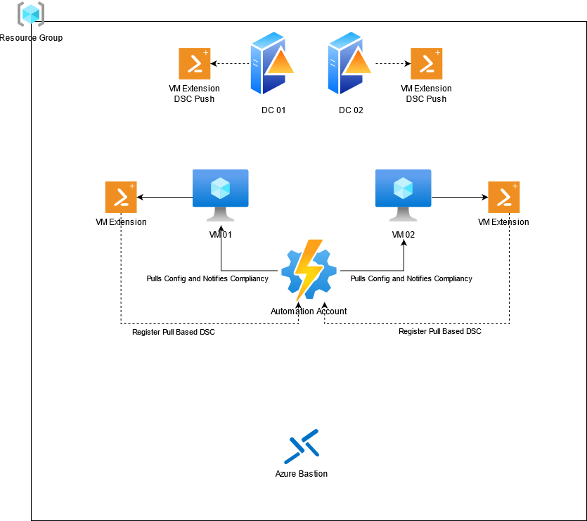

# DSC Demo

## Introduction

This template will create an Active Directory forest with 1 Domain, with 2 Domain Controlers. Two other VMs are created, which can then be joined to that domain semi-manually. 
Both push and pull configuration are used to showcase the differences.



In total, the template creates the following Azure Resources:

* A resource group
* A VNET
* 2 Subnets (Azure Bastion and 1 for all other VMs)
* An availability set
* 4 Virtual machines
  * Two domain controllers, configured with DSC Push
  * Two VMs, configured with DSC Pull 
* An automation account
  * Two variables (dscDNSServer and dscDomainName)
  * A shared credentail (dscDomainAdmin)
  * 1 DSC Configuration (timezone, non compiled)
  * 1 Node configuration (timezone.local, compiled file)
* 1 Public IP for the Bastion
* The Bastion itself

## Getting Started

### Prerequisites

**Installing Terraform**

> On Windows, [Chocolatey](https://chocolatey.org/) is preferred to install Terraform and Git.

1. [Azure CLI](https://docs.microsoft.com/en-us/cli/azure/install-azure-cli)
2. [Visual Studio Code](https://code.visualstudio.com/download)
3. [Terraform](https://learn.hashicorp.com/tutorials/terraform/install-cli?in=terraform/azure-get-started)
4. [GIT](https://arxus.service-now.com/nav_to.do?uri=%2Fkb_view.do%3Fsys_kb_id%3D635c7520db7b830091d5f5e51d9619ef)
5. [Visual Studio Code extensions](https://code.visualstudio.com/learn/get-started/extensions) 

    


### Running
1. Open your terminal and run `az login`. If your account is related to multiple tenants, run `az login -t <tenantname>`
2. Set your account context to the correct subscription `az account set -s <subscriptionid>`
3. Run `terraform init`
4. Run `terraform plan` to view the changes
5. Run `terraform apply` if everything looks correct, then type `yes` to confirm

### Manual Steps
1. Upload the `JoinDomain.ps1` script to the DSC Configurations
2. Compile the config 
In powershell execute the following
    ```powershell
    $ConfigData = @{
        AllNodes = @(
            @{
                NodeName                    = 'localhost'
                PSDscAllowPlainTextPassword = $True
                PSDscAllowDomainUser = $True
            }
        )
    }

    Start-AzAutomationDscCompilationJob -ResourceGroupName 'dc-demo' -AutomationAccountName 'aa-demo' -ConfigurationName 'ComputerJoinDomain' -ConfigurationData $ConfigData
    ```

3. Assign Nodes to the compiled configuration

## Possible Quirks

### Import module

Terraform might complain that the module already exists, run the below command to import the existing module. (replace the 3 variables)

`terraform import 'azurerm_automation_module.dsc_modules[\"ComputerManagementDsc\"]' /subscriptions/<sub-id>/resourceGroups/<rg-name>/providers/Microsoft.Automation/automationAccounts/<aa-name>/modules/ComputerManagementDsc`